# Structured3D


Structured3D is a large-scale photo-realistic dataset containing 3.5K house designs **(a)** created by professional designers with a variety of ground truth 3D structure annotations **(b)** and generate photo-realistic 2D images **(c)**.

## Paper

**Structured3D: A Large Photo-realistic Dataset for Structured 3D Modeling**

[Jia Zheng](https://bertjiazheng.github.io/)\*,
[Junfei Zhang](https://www.linkedin.com/in/骏飞-张-1bb82691/?locale=en_US)\*,
[Jing Li](https://cn.linkedin.com/in/jing-li-253b26139),
[Rui Tang](https://cn.linkedin.com/in/rui-tang-50973488),
[Shenghua Gao](http://sist.shanghaitech.edu.cn/sist_en/2018/0820/c3846a31775/page.htm),
[Zihan Zhou](https://faculty.ist.psu.edu/zzhou)

European Conference on Computer Vision (ECCV), 2020

[[Preprint](https://arxiv.org/abs/1908.00222)] 
[[Paper](https://www.ecva.net/papers/eccv_2020/papers_ECCV/papers/123540494.pdf)] 
[[Supplementary Material](https://www.ecva.net/papers/eccv_2020/papers_ECCV/papers/123540494-supp.pdf)] 
[[Benchmark](https://competitions.codalab.org/competitions/24183)]

(\* Equal contribution)

## Data

The dataset consists of rendering images and corresponding ground truth annotations (_e.g._, semantic, albedo, depth, surface normal, layout) under different lighting and furniture configurations. Please refer to [data organization](data_organization.md) for more details.

To download the dataset, please fill the [agreement form](https://forms.gle/LXg4bcjC2aEjrL9o8) that indicates you agree to the [Structured3D Terms of Use](https://drive.google.com/open?id=13ZwWpU_557ZQccwOUJ8H5lvXD7MeZFMa). After we receive your agreement form, we will provide download access to the dataset.

For fair comparison, we define standard training, validation, and testing splits as follows: _scene_00000_ to _scene_02999_ for training, _scene_03000_ to _scene_03249_ for validation, and _scene_03250_ to _scene_03499_ for testing.

## Errata

- 2020-04-06: We provide a list of invalid cases [here](metadata/errata.txt). You can ignore these cases when using our data.
- 2020-03-26: Fix issue [#10](https://github.com/bertjiazheng/Structured3D/issues/10) about the basis of the bounding box annotations. Please re-download the annotations if you use them.

## Tools

We provide the basic code for viewing the structure annotations of our dataset.

### Installation

Clone repository:

```bash
git clone git@github.com:bertjiazheng/Structured3D.git
```

Please use Python 3, then follow [installation](https://pymesh.readthedocs.io/en/latest/installation.html) to install [PyMesh](https://github.com/PyMesh/PyMesh) (only for plane visualization) and the other dependencies:

```bash
conda install -y open3d -c open3d-admin
conda install -y opencv -c conda-forge
conda install -y descartes matplotlib numpy shapely
pip install panda3d
```

### Visualize 3D Annotation

We use [open3D](https://github.com/intel-isl/Open3D) for wireframe and plane visualization, please refer to interaction control [here](http://www.open3d.org/docs/tutorial/Basic/visualization.html#function-draw-geometries).

```bash
python visualize_3d.py --path /path/to/dataset --scene scene_id --type wireframe/plane/floorplan
```

| Wireframe                             | Plane                         | Floorplan                             |
| ------------------------------------- | ----------------------------- | ------------------------------------- |
| 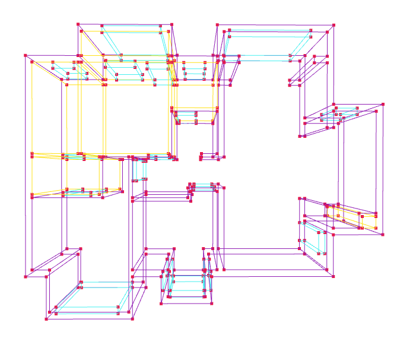 | 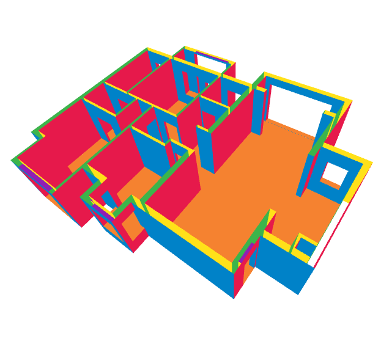 |  |

### Visualize 3D Textured Mesh

```bash
python visualize_mesh.py --path /path/to/dataset --scene scene_id --room room_id
```

<p align="center">
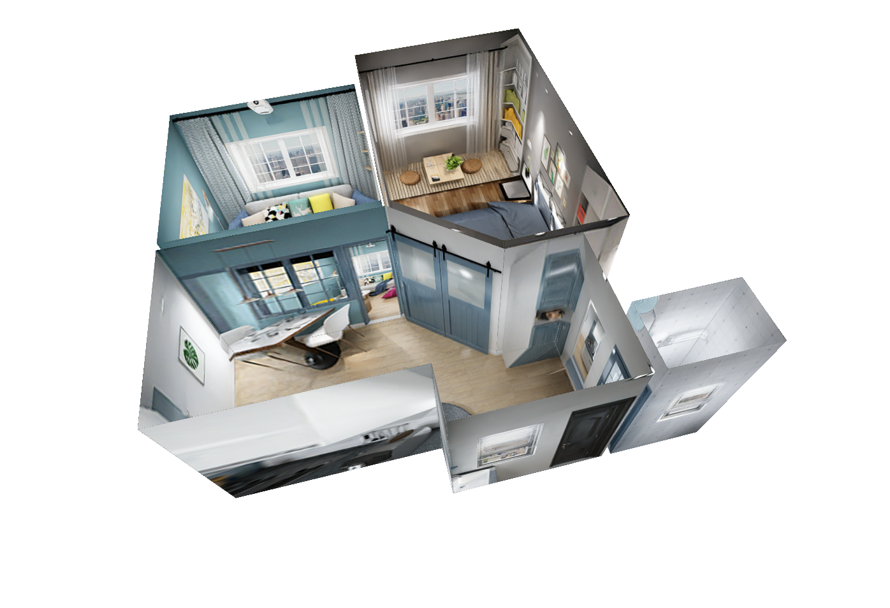
</p>

### Visualize 2D Layout

```bash
python visualize_layout.py --path /path/to/dataset --scene scene_id --type perspective/panorama
```

#### Panorama Layout

<p align="center">
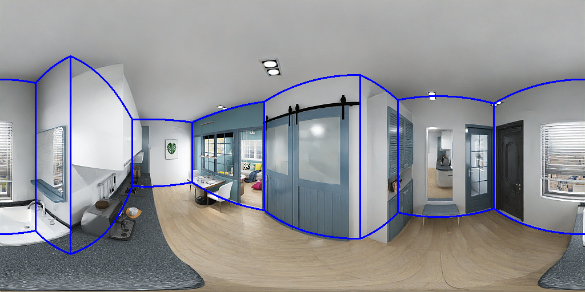
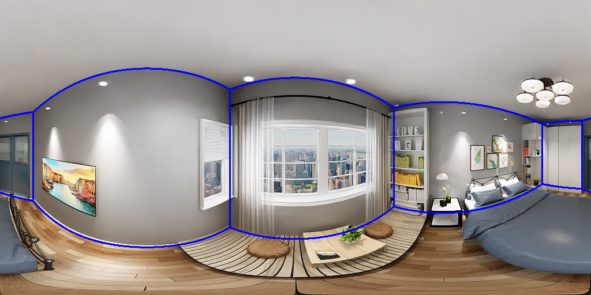
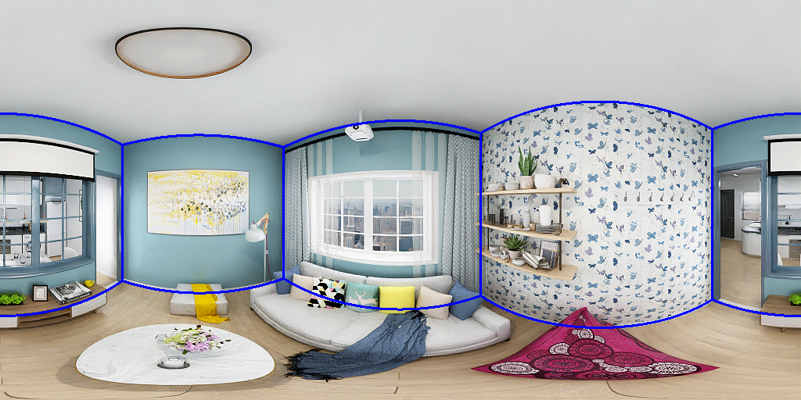
</p>

Please refer to the [Supplementary Material](https://www.ecva.net/papers/eccv_2020/papers_ECCV/papers/123540494-supp.pdf) for more example ground truth room layouts.

#### Perspective Layout

<p align="center">
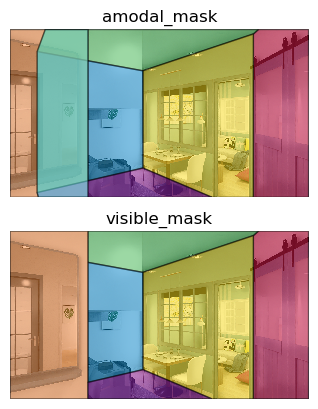

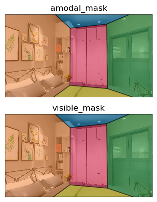
</p>

### Visualize 3D Bounding Box

```bash
python visualize_bbox.py --path /path/to/dataset --scene scene_id
```

<p align="center">
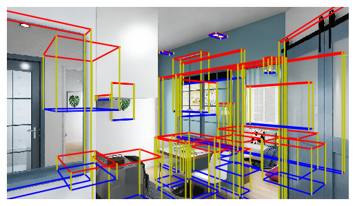
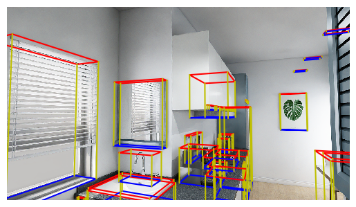
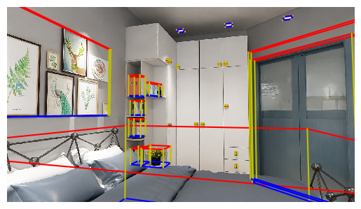
</p>

## Citation

Please cite `Structured3D` in your publications if it helps your research:

```bibtex
@inproceedings{Structured3D,
  title     = {Structured3D: A Large Photo-realistic Dataset for Structured 3D Modeling},
  author    = {Jia Zheng and Junfei Zhang and Jing Li and Rui Tang and Shenghua Gao and Zihan Zhou},
  booktitle = {Proceedings of The European Conference on Computer Vision (ECCV)},
  year      = {2020}
}
```

## License

The data is released under the [Structured3D Terms of Use](https://drive.google.com/open?id=13ZwWpU_557ZQccwOUJ8H5lvXD7MeZFMa), and the code is released under the [MIT license](LICENSE).

## Contact

Please contact us at [Structured3D Group](mailto:structured3d@googlegroups.com) if you have any questions.

## Acknowledgement

We would like to thank Kujiale.com for providing the database of house designs and the rendering engine. We especially thank Qing Ye and Qi Wu from Kujiale.com for the help on the data rendering.
