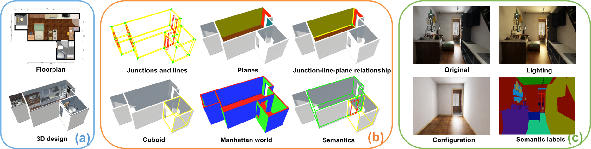
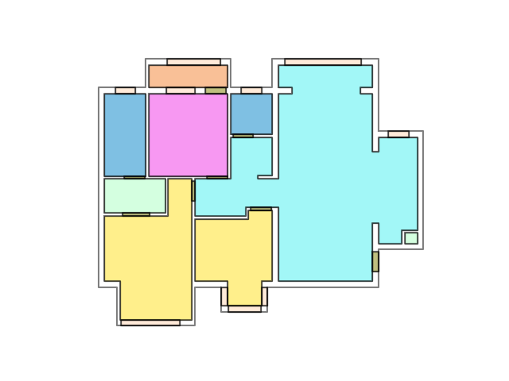

# Structured3D



Structured3D is a large-scale photo-realistic dataset containing 3.5K house designs **(a)** created by professional designers with a variety of ground truth 3D structure annotations **(b)** and generate photo-realistic 2D images **(c)**.

## Paper

[**Structured3D: A Large Photo-realistic Dataset for Structured 3D Modeling**](https://arxiv.org/pdf/1908.00222.pdf)

[Jia Zheng](https://bertjiazheng.github.io/)\*, 
Junfei Zhang\*,
[Jing Li](https://cn.linkedin.com/in/jing-li-253b26139)\*, 
Rui Tang,
[Shenghua Gao](http://sist.shanghaitech.edu.cn/sist_en/2018/0820/c3846a31775/page.htm), 
[Zihan Zhou](https://faculty.ist.psu.edu/zzhou)

(\* Equal contribution)

## Data

The dataset consists of rendering images and corresponding ground truth annotations (*e.g.*, semantic, albedo, depth, surface normal, layout) under different lighting and furniture configurations. Please refer to [data organization](data_organization.md) for more details.

To download the dataset, please fill the [agreement form](https://forms.gle/LXg4bcjC2aEjrL9o8) that indicate you agree to the [Structured3D Terms of Use](https://drive.google.com/open?id=13ZwWpU_557ZQccwOUJ8H5lvXD7MeZFMa). After we receive your agreement form, we will provide download access to the dataset. 

For fair comparison, we define standard training, validation, and testing splits as follows: *scene_00000* to *scene_02999* for training, *scene_03000* to *scene_03249* for validation, and *scene_03250* to *scene_03499* for testing.

## Tools

We provide the basic code for viewing the structure annotations of our dataset.

### Installation

Clone repository:
```bash
git clone git@github.com:bertjiazheng/Structured3D.git
```

Please use Python 3, then follow [installation](https://pymesh.readthedocs.io/en/latest/installation.html) to install [PyMesh](https://github.com/PyMesh/PyMesh) (only for plane visualization) and the other dependencies:
```bash
conda install -y open3d -c open3d-admin
conda install -y descartes shapely matplotlib
```

### Visualize 3D Annotation

We use [open3D](https://github.com/intel-isl/Open3D) for wireframe and plane visualization, please refer to interaction control [here](http://www.open3d.org/docs/tutorial/Basic/visualization.html#function-draw-geometries). 
```bash
python visualize_3d.py --path /path/to/dataset --name scene_id --type wireframe/plane/floorplan
```

Wireframe                          | Plane                      | Floorplan
---------------------------------- | -------------------------- | ----------------------------------
 |  |  

### Visualize 2D Layout

```bash
python visualize_layout.py --path /path/to/dataset --name scene_id --type empty/simple/full
```

## Citation
Please cite `Structured3D` in your publications if it helps your research:
```
@article{Structured3D,
  title   = {Structured3D: A Large Photo-realistic Dataset for Structured 3D Modeling},
  author  = {Jia Zheng and Junfei Zhang and Jing Li and Rui Tang and Shenghua Gao and Zihan Zhou},
  journal = {CoRR},
  volume  = {abs/1908.00222},
  year    = {2019}
}
```

## License

The data is released under the [Structured3D Terms of Use](https://drive.google.com/open?id=13ZwWpU_557ZQccwOUJ8H5lvXD7MeZFMa), and the code is released under the [MIT license](LICENSE).

## Contact
Please contact us at [Structured3D Group](mailto:structured3d@googlegroups.com) if you have any questions.

## Acknowledgements

We would like to thank <a href="http://kujiale.com">Kujiale.com</a> for providing the database of house designs and the rendering engine.
