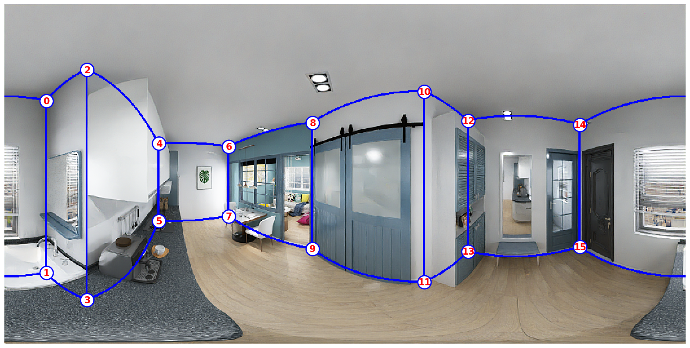

# Data Organization

There is a separate subdirectory for every scene (_i.e._, house design), which is named by a unique ID. Within each scene directory, there are separate directories for different types of data as follows:

```
scene_<sceneID>
├── 2D_rendering
│   └── <roomID>
│       ├── panorama
│       │   ├── <empty/simple/full>
│       │   │   ├── rgb_<cold/raw/warm>light.png
│       │   │   ├── semantic.png
│       │   │   ├── instance.png
│       │   │   ├── albedo.png
│       │   │   ├── depth.png
│       │   │   └── normal.png
│       │   ├── layout.txt
│       │   └── camera_xyz.txt
│       └── perspective
│           └── <empty/full>
│               └── <positionID>
│                   ├── rgb_rawlight.png
│                   ├── semantic.png
│                   ├── instance.png
│                   ├── albedo.png
│                   ├── depth.png
│                   ├── normal.png
│                   ├── layout.json
│                   └── camera_pose.txt
├── bbox_3d.json
└── annotation_3d.json
```

# Annotation Format

We provide the primitive and relationship based structure annotation for each scene, and oriented bounding box for each object instance.

**Structure annotation (`annotation_3d.json`)**: see all the room types [here](metadata/room_types.txt).

```
{
  // PRIMITVIES
  "junctions":[
    {
      "ID":             : int,
      "coordinate"      : List[float]       // 3D vector
    }
  ],
  "lines": [
    {
      "ID":             : int,
      "point"           : List[float],      // 3D vector
      "direction"       : List[float]       // 3D vector
    }
  ],
  "planes": [
    {
      "ID":             : int,
      "type"            : str,              // ceiling, floor, wall
      "normal"          : List[float],      // 3D vector, the normal points to the empty space
      "offset"          : float
    }
  ],
  // RELATIONSHIPS
  "semantics": [
    {
      "ID"              : int,
      "type"            : str,              // room type, door, window
      "planeID"         : List[int]         // indices of the planes
    }
  ],
  "planeLineMatrix"     : Matrix[int],      // matrix W_1 where the ij-th entry is 1 iff l_i is on p_j
  "lineJunctionMatrix"  : Matrix[int],      // matrix W_2 here the mn-th entry is 1 iff x_m is on l_nj
  // OTHERS
  "cuboids": [
    {
      "ID":             : int,
      "planeID"         : List[int]         // indices of the planes
    }
  ]
  "manhattan": [
    {
      "ID":             : int,
      "planeID"         : List[int]         // indices of the planes
    }
  ]
}
```

**Bounding box (`bbox_3d.json`)**: the oriented bounding box annotation in world coordinate, same as the [SUN RGB-D Dataset](http://rgbd.cs.princeton.edu).

```
[
  {
    "ID"        : int,              // instance id
    "basis"     : Matrix[float],    // basis of the bounding box, one row is one basis
    "coeffs"    : List[float],      // radii in each dimension
    "centroid"  : List[float],      // 3D centroid of the bounding box
  }
]
```

For each image, we provide semantic, instance, albedo, depth, normal, layout annotation and camera position. Please note that we have different layout and camera annotation formats for panoramic and perspective images.

**Semantic annotation (`semantic.png`)**: unsigned 8-bit integers within a PNG. We use [NYUv2](https://cs.nyu.edu/~silberman/datasets/nyu_depth_v2) 40-label set, see all the label ids [here](metadata/labelids.txt).

**Instance annotation (`instance.png`)**: unsigned 16-bit integers within a PNG. We only provide instance annotation for full configuration. The maximum value (65535) denotes _background_.

**Albedo data (`albedo.png`)**: unsigned 8-bit integers within a PNG.

**Depth data (`depth.png`)**: unsigned 16-bit integers within a PNG. The units are millimeters, a value of 1000 is a meter. A zero value denotes _no reading_.

**Normal data (`normal.png`)**: unsigned 8-bit integers within a PNG (x, y, z), where the integer values in the file are 128 \* (1 + n), where n is a normal coordinate in range the [-1, 1].

**Layout annotation for panorama (`layout.txt`)**: an ordered list of 2D positions of the junctions (same as [LayoutNet](https://github.com/zouchuhang/LayoutNet) and [HorizonNet](https://github.com/sunset1995/HorizonNet)). The order of the junctions is shown in the figure below. In our dataset, the cameras of the panoramas are aligned with the gravity direction, thus a pair of ceiling-wall and floor-wall junctions share the same x-axis coordinates.

<p align="center">

</p>

**Layout annotation for perspective (`layout.json`)**: We also include the junctions formed by line segments intersecting with each other or image boundary. We consider the visible and invisible parts caused by the room structure instead of furniture.

```
{
  "junctions":[
    {
      "ID"            : int,              // corresponding 3D junction id, none corresponds to fake 3D junction
      "coordinate"    : List[int],        // 2D location in the camera coordinate
      "isvisible"     : bool              // this junction is whether occluded by the other walls
    }
  ],
  "planes": [
    {
      "ID"            : int,              // corresponding 3D plane id
      "visible_mask"  : List[List[int]],  // visible segmentation mask, list of junctions ids
      "amodal_mask"   : List[List[int]],  // amodal segmentation mask, list of junctions ids
      "normal"        : List[float],      // normal in the camera coordinate
      "offset"        : float,            // offset in the camera coordinate
      "type"          : str               // ceiling, floor, wall
    }
  ]
}
```

**Camera location for panorama (`camera_xyz.txt`)**: For each panoramic image, we only store the camera location in millimeters in global coordinates. The direction of the camera is always along the negative y-axis. The z-axis is upward.

**Camera location for perspective (`camera_pose.txt`)**: For each perspective image, we store the camera location and pose in global coordinates.

```
vx vy vz tx ty tz ux uy uz xfov yfov 1
```

where `(vx, vy, vz)` is the eye viewpoint of the camera in millimeters, `(tx, ty, tz)` is the view direction, `(ux, uy, uz)` is the up direction, and `xfov` and `yfov` are the half-angles of the horizontal and vertical fields of view of the camera in radians (the angle from the central ray to the leftmost/bottommost ray in the field of view), same as the [Matterport3D Dataset](https://github.com/niessner/Matterport).
